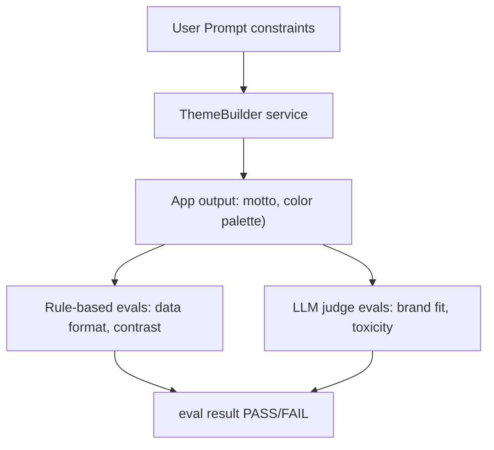

# Evals 101 for web developers

This is the companion code for [Evals 101 for web developers](https://developer.chrome.com/docs/ai/evals).
This repo includes an example evals system that evaluates AI-generated outputs, including rule-based  and LLM-as-a-judge evals.

## Overview

This repo includes:
* A simple web application, ThemeBuilder, that generates a brand identity (motto, color palette, typography) based on a company description and target audience.
* A rule-based evaluator for the application's outputs.
* An LLM-as-a-judge evaluator for the application's outputs.
* Tests for the evaluators themselves.
* Tests for the application's outputs, based on the evaluator.




## Set up

1. Create a [Gemini API key](https://ai.google.dev/gemini-api/docs/api-key).
2. Create an `.env` file in the `evals-service` directory with your `GEMINI_API_KEY`.
3. Install dependencies: `npm install` (run from the root of `evals-course`)

## Testing and running evals

Running evaluations from the `evals-course` root:

### 1. Testing the evaluators (= testing the evaluators themselves)

These scripts test the **evaluator functions themselves** and assess the correctness of the criteria and LLM scoring logic. You'd typically run these tests when you're developing the evaluators.

Run tests for rule-based evaluators:
```bash
npm run test:rule-based-evals
```

Run basic tests for LLM-as-a-judge evaluators (alignment% only):
```bash
npm run test:llm-judge-basic-evals
```

Run advanced tests for LLM-as-a-judge evaluators (alignment%, Cohen's Kappa, precision, recall):
```bash
npm run test:llm-judge-evals
```

### 2. Evaluating application outputs

This executes the real `ThemeBuilder` application service against a dataset of prompts, using both static rules and our evaluators (rule-based and LLM judge) to grade the final AI-generated outputs.

Run unit testing for the AI application:
```bash
npm run test:unit-evals
```

### Fast mode

You can append `-fast` to any script to run in **fast mode** (e.g., `npm run test:unit-evals-fast` or `npm run test:all-fast`).

Fast mode caps evaluation scenarios to a small number of samples per suite. Recommended for rapid local iteration and debugging to avoid long wait times.


## Running the eval service

Run the service: `npm start` (or `npm run dev` for development)
   -  Note: The service runs on **port 8080** by default.

Once the service is running, you can evaluate data by sending a POST request to `/api/evaluate`.

Here is an example using `curl`:

```bash
curl -X POST http://localhost:8080/api/evaluate \
  -H "Content-Type: application/json" \
  -d '{
    "data": [
      {
        "id": "brand-003",
        "userInput": {
          "companyName": "Loom",
          "description": "A boutique textile mill specializing in traditional indigo-dyeing and hand-loomed linens.",
          "audience": "interior designers and slow-fashion advocates",
          "tone": ["tactile", "minimalist", "earthy"]
        },
        "appOutput": {
          "motto": "Woven by hand and time.",
          "colorPalette": {
            "textColor": "#262626",
            "backgroundColor": "#F5F5F4",
            "primary": "#312E81",
            "secondary": "#A8A29E"
          }
        }
      }
    ]
  }'
```

This will return an evaluation result containing the format validation label and several LLM-as-a-judge checks.

For example:

```json
{
  "results": [
    {
      "id": "brand-003",
      "dataFormat": {
        "label": "PASS",
        "rationale": "Format is valid."
      },
      "mottoBrandFit": {
        "label": "PASS",
        "rationale": "The motto aligns perfectly with the brand's commitment to slow craftsmanship and tradition. 'Woven by hand' emphasizes the tactile and artisanal nature of the product, while 'time' appeals to the slow-fashion ethos. The brevity of the phrase maintains a minimalist and sophisticated tone suitable for the target audience."
      }
    }
  ],
  "modelVersion": "gemini-3-flash-preview"
}
```
